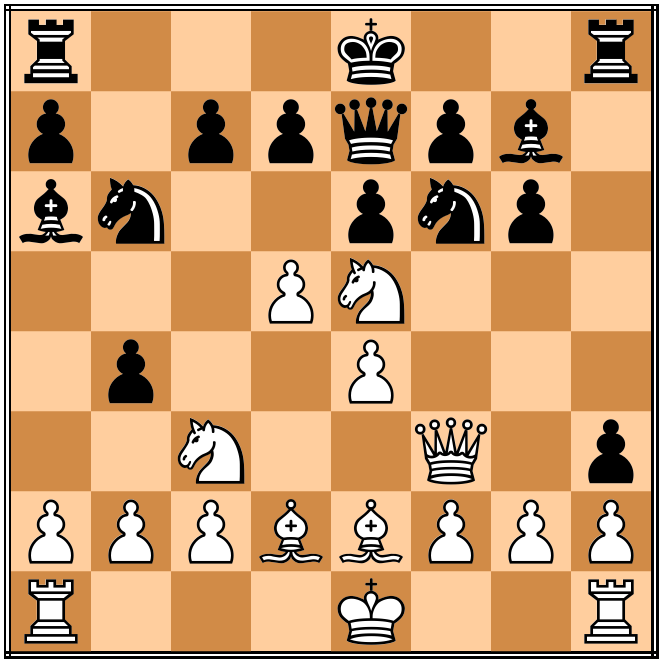

# OmegaZero Chess Engine

###### Noah Himed


### Project Summary

OmegaZero is an in-progress terminal-based chess engine which will allow a user
to play against an AI. The name "OmegaZero" is an homage to [AlphaZero](https://en.wikipedia.org/wiki/AlphaZero), a program
developed by [DeepMind](https://deepmind.com/) that was used to create one of the world's
best Chess engines. The [Chess Programming Wiki](https://www.chessprogramming.org/Main_Page) was referenced heavily during
development. Credit goes to [Bradon Hsu](https://github.com/2brandonh) for designing the
logo for this project.

### Status: In Progress

A basic AI has been implemented using the NegaMax search algorithm with some
optimizations and an evaluation  function based purely on computing material 
advantage. This basic evaluation implementation's purpose is to serve as a 
placeholder for developing the search algorithm. Once development is finished
with search, a more advanced evaluation function will be implemented.

### Usage

#### Prerequisites

The included `Makefile` is designed to run on GNU/Linux machines. The [Boost library](https://www.boost.org/)
is a requirement, and should be installed locally before compilation.
On Ubuntu systems, users may use the `apt-get` package manager to
install Boost like so:
```
sudo apt-get install libboost-all-dev
```

#### User Input

##### Playing a Game

To begin a game, a user invokes the program as follows:
```
build/OmegaZero -p [SIDE]
```
where `[SIDE]` is the side the user would like to player. This may be `w` for
White, `b` for Black, or `r` for a random selection.

The format used to denote entered moves is based around [FIDE standard algebraic
notation](https://www.chessprogramming.org/Algebraic_Chess_Notation#Standard_Algebraic_Notation_.28SAN.29). The only exception to FIDE notation is that `e.p.` **must** immediately
follow an en passant move without a space (in FIDE rules, this is optional). Further specification is only needed
to avoid ambiguity in a movement command. Some valid example moves are
 - Move pawn to e4: `e4`
 - Move queen to e4: `Qe4`
 - Move pawn to d8 and promote to queen: `d8Q`
 - Pawn takes piece on d6: `exd6`
 - Night takes piece on e4: `Nxe4`
 - Rook on rank 1 moves to a3: `R1a3`
 - Rook on d file moves to f8: `Rdf8`
 - Pawn takes a piece on d8 and promotes to queen: `exd8Q`
 - Queen from h4 moves to e1: `Qh4e1`
 - Queen from h4 takes piece on e1: `Qh4xe1`
 - Pawn from e file takes pawn on d5 in en passant: `exd6e.p.`
 - Queenside castle: `0-0-0`
 - Kingside castle: `0-0`

To resign, a user must enter `q` on their turn.

##### Testing

To print out the [Perft](https://www.chessprogramming.org/Perft) results for engine, invoke the program as follows:
```
build/OmegaZero -i [POSITION] -t [DEPTH]
```
`[POSITION]` is a [FEN](https://www.chessprogramming.org/Forsyth-Edwards_Notation) formatted string denoting the intial position to
start counting nodes from in the search tree; not providing this will cause the
program to default to the standard initial position in a chess game. 

`[DEPTH]` is a positive integer denoting the number of levels to generate in
the search tree.

After doing this, users have the choice of entering either a move formatted as
previously outlined to walk the search tree, or `q` to exit the program.

The positions on [this page](https://www.chessprogramming.org/Perft_Results) were used to confirm the correctness of the move
generator.

To print out statistics of the search and evaluation of board states in the search tree, invoke the program as follows:
```
build/OmegaZero -i [POSITION] -s [DEPTH]
```
where `[POSITION]` is defined above, and `[DEPTH]` is the maximum depth of the
search used to evaluate search statistics.

### Implementation

#### Board Representation

The engine uses both [Bitboards](https://www.chessprogramming.org/Bitboards) and an [8x8 Board](https://www.chessprogramming.org/8x8_Board) to represent board.
states. Squares are indexed in the Little Endian Rank File (LERF) format.

#### Move Generation

For non-sliding pieces, arrays of bitboards representing all possible places
a piece can move to on an empty board for every square are computed
by `generate_masks.py`. For sliding pieces, move generation is implemented
through the [magic bitboard technique](http://pradu.us/old/Nov27_2008/Buzz/research/magic/Bitboards.pdf).

The move generation function `Engine::GenerateMoves()` is implemented as a
[pseudo-legal generator](https://www.chessprogramming.org/Move_Generation#Pseudo-legal). A full legality check is made in `Board::MakeMove()`
to ensure that a move does not put the moving player in check; illegal moves are
unmade if they are found to do this.

#### Board Hashing

In order efficiently compare positions throughout a game, `Game` objects use the
function `Board::GetBoardHash()` to compute hashes of game states. This function is
implemented with the [Zobrist Hashing](https://www.chessprogramming.org/Zobrist_Hashing) algorithm, and is used during the detection
of both threefold and fivefold move repitions and to generate keys to index into the
transposition table. This technique carries with it a small risk for collisions, with
an expected collision rate of one in 2^32 ≈ 4.29 billion. Relatively little can be done
to mitigate this risk, and as such is a known and unavoidable bug with this
implementation.

#### Search

The search algorithm used is the [NegaMax](https://www.chessprogramming.org/Negamax) algorithm with [alpha-beta pruning](https://www.chessprogramming.org/Alpha-Beta).
A [transposition table](https://www.chessprogramming.org/Transposition_Table) is also used to prevent re-evaluating positions that
have already been seen during a search.

#### Evaluation

The evaluation function scores the board based purely on material. The formula
for board scores is
```
score = pawn_value * (#white_pawns - #black_pawns)
        + knight_value * (#white_knights - #black_knights)
        + bishop_value * (#white_bishops - #black_bishops)
        + rook_value * (#white_roooks - #black_rooks)
        + queen_value * (#white_queens - #black_queens)
        + king_value * (#white_kings - #black_kings)
```
Here, a positive score favors White, while a negative score favors Black. The
piece values are expressed in centipawns, listed below:

| Piece | Value |
|-------|-------|
| Pawn  | 100   |
| Knight| 320   |
| Bishop| 330   |
| Rook  | 500   |
| Queen | 900   |
| King  | 20000 |

### Performance

#### Move Generation

The move generator is capable of producing up to ~7 million moves/sec.

#### Search

The following is a table demonstrating how the addition of new search features
(alpha-beta pruning, a transposition table, etc.) changed the average time it 
took the engine to perform a search 5 plys deep from this position



Please note that these features were applied cummulatively to the engine, and
times shown are the result of all features up to and including the new feature
addition.

|Feature|Time [s]|
|---|---|
|Basic Minimax Search|41.159|
|Alpha-Beta Pruning + Transposition Table|0.290|