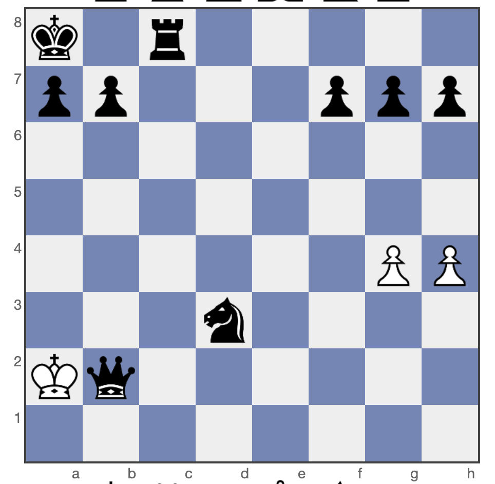
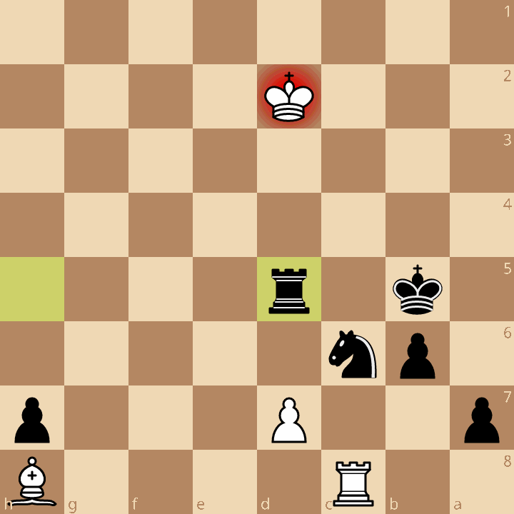
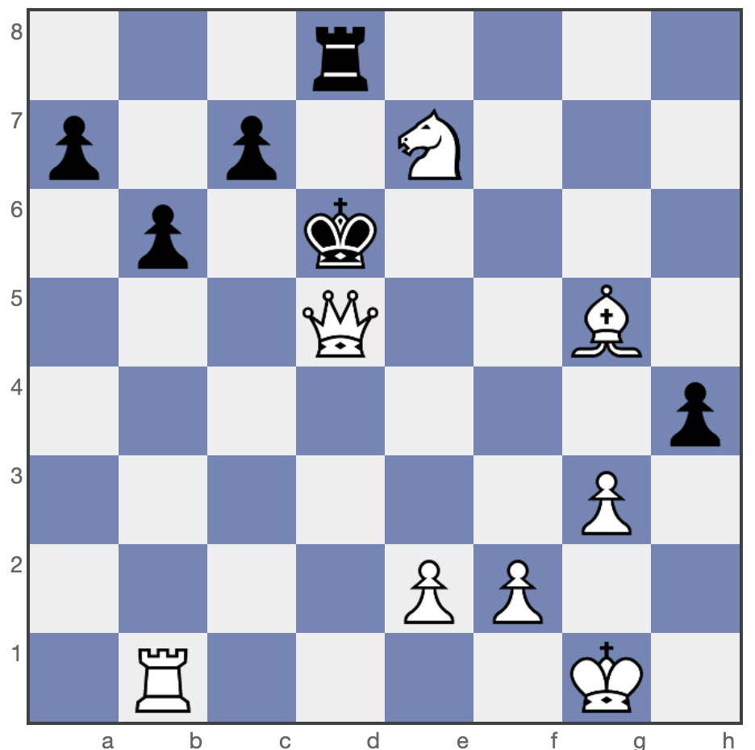

# OmegaZero

###### Noah Himed


### Table of Contents

- [Project Summary](#project-summary)
- [Usage](#usage)
  - [Prerequisites](#prerequisites)
  - [ELO Testing Dependencies](#elo-testing-dependencies)
  - [Building](#building)
  - [Playing a Game](#playing-a-game)
  - [UCI Mode](#uci-mode)
  - [ELO Testing](#elo-testing)
  - [Perft Testing](#perft-testing)
  - [Test Harness](#test-harness)
  - [Benchmarking](#benchmarking)
  - [Generating Move Tables](#generating-move-tables)
- [Implementation](#implementation)
  - [Board Representation](#board-representation)
  - [Move Generation](#move-generation)
  - [Transposition Table](#transposition-table)
  - [Search](#search)
  - [Opening Book](#opening-book)
  - [Evaluation](#evaluation)
- [Performance](#performance)
  - [NPS Comparison](#nodes-per-second-nps-comparison)
  - [Stockfish ELO Comparison](#stockfish-elo-comparison)
    - [v1 Results](#v1-results)
    - [v2 Results](#v2-results)
    - [v3 Results](#v3-results)
  - [Example Games](#example-games)
  - [Strengths and Weaknesses](#strengths-and-weaknesses)

### Project Summary

OmegaZero is a chess engine built from scratch which allows a user to play 
against an AI. The name "OmegaZero" is an homage to [AlphaZero](https://en.wikipedia.org/wiki/AlphaZero), a program
developed by [DeepMind](https://deepmind.com/) that was used to create one of the world's
best Chess engines. The [Chess Programming Wiki](https://www.chessprogramming.org/Main_Page) was referenced heavily during
development. Credit goes to [Bradon Hsu](https://github.com/2brandonh) for designing the
logo for this project.

### Usage

#### Prerequisites

The included `Makefile` supports both GNU/Linux and macOS. The [Boost library](https://www.boost.org/)
is a requirement and should be installed locally before compilation. `python3` is
also required to generate the move masks and magic bitboards used by the engine.

To verify all dependencies are satisfied before building, run:
```
make check-deps
```

On Ubuntu, install Boost via `apt-get`:
```
sudo apt-get install libboost-all-dev
```

On macOS, install Boost via [Homebrew](https://brew.sh/). If Homebrew isn't installed,
follow the instructions on their site first, then run:
```
brew install boost
```

#### ELO Testing Dependencies

To run automated ELO testing, the following additional tools are required:

- [Stockfish](https://stockfishchess.org/) — opponent engine
- [Cute Chess](https://github.com/cutechess/cutechess) (`cutechess-cli`) — tournament manager
- [matplotlib](https://matplotlib.org/) — plot generation (Python)

On MacOS, install cutechess from source:

```bash
brew install stockfish qt cmake
pip3 install matplotlib --break-system-packages

cd ~/path/to/OmegaZero
git clone https://github.com/cutechess/cutechess.git
cd cutechess
mkdir build && cd build
cmake ..
make -j8
```

On Ubuntu, install with `apt-get`:
```
sudo apt-get install stockfish cutechess qtbase5-dev cmake
pip3 install matplotlib
```

#### Building

```
make              # Optimized engine binary → build/OmegaZero
make debug        # Debug test harness (ASan, -O0) → build/test_harness
make bench        # NPS benchmark harness (-O3) → build/bench_harness
make clean        # Remove all build artifacts
make check-deps   # Verify g++, python3, and Boost are installed
```

#### Playing a Game

To begin a game, a user invokes the program as follows:
```
OmegaZero -p [SIDE] -t [TIME]
```
where `[SIDE]` is the side the user would like to play. This may be `w` for
White, `b` for Black, or `r` for a random selection. `[TIME]` is the amount of time (in seconds) to give the engine during play. This defaults to `5s`.

To start from a custom position, add `-i` with a [FEN](https://www.chessprogramming.org/Forsyth-Edwards_Notation) string. Use `w` or `b` in the FEN to set which side moves first:
```
OmegaZero -i "rnbqkbnr/pppppppp/8/8/4P3/8/PPPP1PPP/RNBQKBNR w KQkq - 0 1" -p w -t 5  # white to move
OmegaZero -i "rnbqkbnr/pppppppp/8/8/4P3/8/PPPP1PPP/RNBQKBNR b KQkq - 0 1" -p b -t 5  # black to move
```

The format used to denote entered moves is based around [FIDE standard algebraic
notation](https://www.chessprogramming.org/Algebraic_Chess_Notation#Standard_Algebraic_Notation_.28SAN.29). The only exception to FIDE notation is that `e.p.` **must** immediately
follow an en passant move without a space (in FIDE rules, this is optional). Further specification is only needed
to avoid ambiguity in a movement command. Some valid example moves are
 - Move pawn to e4: `e4`
 - Move queen to e4: `Qe4`
 - Move pawn to d8 and promote to queen: `d8Q`
 - Pawn takes piece on d6: `exd6`
 - Knight takes piece on e4: `Nxe4`
 - Rook on rank 1 moves to a3: `R1a3`
 - Rook on d file moves to f8: `Rdf8`
 - Pawn takes a piece on d8 and promotes to queen: `exd8Q`
 - Queen from h4 moves to e1: `Qh4e1`
 - Queen from h4 takes piece on e1: `Qh4xe1`
 - Pawn from e file takes pawn on d5 in en passant: `exd6e.p.`
 - Queenside castle: `0-0-0`
 - Kingside castle: `0-0`

To resign, a user must enter `q` on their turn.

#### UCI Mode

OmegaZero supports the [Universal Chess Interface](https://www.chessprogramming.org/UCI) (UCI) protocol for
integration with chess GUIs and tournament managers. To launch in UCI mode:
```
OmegaZero --uci
```

#### ELO Testing

The `scripts/elo_test.py` script automates ELO estimation by running OmegaZero
against Stockfish at various strength levels via cutechess-cli. It records
per-game results to CSV and generates summary tables and plots.

Run matches (default: 20 games each at ELO 1320, 1500, 1700, 1900, 2100, 0.1s/move):
```
python3 scripts/elo_test.py run
```

Customize the test:
```
python3 scripts/elo_test.py run --elo-levels 1400,1600,1800,2000 --games 50 --st 0.5
```

Regenerate plots and summary table from existing results:
```
python3 scripts/elo_test.py plot --input elo_results
```

Results are saved to `elo_results/` by default:
- `games.csv` — per-game results with running ELO estimates
- `summary.csv` — win/draw/loss totals and ELO estimate per opponent level
- `elo_convergence.png` — ELO estimate over games played (one line per level)
- `wdl_by_level.png` — win/draw/loss bar chart by opponent strength
- `elo_by_level.png` — ELO estimate by opponent strength with average line

#### Perft Testing

To print out the [Perft](https://www.chessprogramming.org/Perft) results for engine, invoke the program as follows:
```
OmegaZero -i [POSITION] -d [DEPTH]
```
`[POSITION]` is a [FEN](https://www.chessprogramming.org/Forsyth-Edwards_Notation) formatted string denoting the intial position to
start counting nodes from in the search tree; not providing this will cause the
program to default to the standard initial position in a chess game. 

`[DEPTH]` is a positive integer denoting the number of levels to generate in
the search tree.

After doing this, users have the choice of entering either a move formatted as
previously outlined to walk the search tree, or `q` to exit the program.

The positions on [this page](https://www.chessprogramming.org/Perft_Results) were used to confirm the correctness of the move
generator.

#### Test Harness

The debug test harness runs perft regression, eval sanity, search sanity,
and self-play crash detection:
```
make debug
./build/test_harness
```

#### Benchmarking

The bench harness measures search speed (nodes per second) across four
positions (opening, midgame, complex midgame, endgame) at 5s each:
```
make bench
./build/bench_harness
```

#### Generating Move Tables

The engine relies on two precomputed source files for move generation.
These are checked into the repo and only need to be regenerated if the
underlying scripts change:

- `scripts/generate_masks.py` — generates `src/masks.cc`, which contains
  precomputed attack bitboards for non-sliding pieces (knights, kings, pawns)
  at every square.
- `scripts/mine_magics.py` — generates `src/magics.cc`, which contains
  [magic numbers](https://www.chessprogramming.org/Magic_Bitboards) for
  sliding piece (bishop, rook) move generation.

To regenerate:
```
python3 scripts/generate_masks.py
python3 scripts/mine_magics.py
```

`make` will automatically regenerate these files if they are missing.

### Implementation

#### Board Representation

The engine uses both [Bitboards](https://www.chessprogramming.org/Bitboards) and an [8x8 Board](https://www.chessprogramming.org/8x8_Board) to represent board.
states. Squares are indexed in the [Little Endian Rank File (LERF)](https://www.chessprogramming.org/Square_Mapping_Considerations#Little-Endian_Rank-File_Mapping) format.

#### Move Generation

For non-sliding pieces, arrays of bitboards representing all possible places
a piece can move to on an empty board for every square are computed
by `generate_masks.py`. For sliding pieces, move generation is implemented
through the [magic bitboard technique](http://pradu.us/old/Nov27_2008/Buzz/research/magic/Bitboards.pdf).

The move generation function `Engine::GenerateMoves()` is implemented as a
[pseudo-legal generator](https://www.chessprogramming.org/Move_Generation#Pseudo-legal). A full legality check is made in `Board::MakeMove()`
to ensure that a move does not put the moving player in check; illegal moves are
unmade if they are found to do this.

#### Transposition Table

A custom hash table was used to implement the [Transposition Table](https://www.chessprogramming.org/Transposition_Table).
The [Zobrist Hashing](https://www.chessprogramming.org/Zobrist_Hashing) 
algorithm was used to hash board states. This technique has an expected collision
rate of one in 2^32 ≈ 4.29 billion. Relatively little can be done
to mitigate this risk, and as such is a known and unavoidable bug with this
implementation. The Transposition Table is [two-tiered](https://www.chessprogramming.org/Transposition_Table#Two-tier_System), using the
"Always Replace" and "Depth-Preferred" replacement schemes in parallel.

#### Search

The [MTD(f)](https://www.chessprogramming.org/MTD(f)) search algorithm is used within an [Iterative Deepening](https://www.chessprogramming.org/Iterative_Deepening)
framework. This routine calls an implementation of the [Negamax](https://www.chessprogramming.org/Negamax) algorithm
with [alpha-beta pruning](https://www.chessprogramming.org/Alpha-Beta), [Null Move Pruning](https://www.chessprogramming.org/Null_Move_Pruning), and [Late Move Reduction](https://www.chessprogramming.org/Late_Move_Reductions). A depth reduction value [R](https://www.chessprogramming.org/Depth_Reduction_R)
of 3 is used when depth is greater than 6, and 2 otherwise in Null Move Pruning.
Late Move Reductions are computed using the formula
```
int(sqrt(double(depth-1)) + sqrt(double(move_idx-1)))
```
taken from [Fruit](https://www.chessprogramming.org/Fruit). Reduction is only done on non-PV (Principle Variation) nodes. A
Transposition Table is used to cache seen positions, allowing the engine to
store each [node's type](https://www.chessprogramming.org/Node_Types) and prevent costly re-evaluation of a node. This
is especially important for storing the [Principle Variation](https://www.chessprogramming.org/Principal_Variation) during Iterative
Deepening.

After search to a specified depth, all captures are searched during the
[Quiescence Search](https://www.chessprogramming.org/Quiescence_Search) to limit the [Horizon Effect](https://www.chessprogramming.org/Horizon_Effect). [Delta Pruning](https://www.chessprogramming.org/Delta_Pruning) is used to
limit the number of nodes explored during Quiescence Search.

To reduce the number of nodes needed to be searched, OmegaZero takes advantage
of a set of heuristics to perform move ordering in `Engine::OrderMoves()` in
order to increase the number of [Beta-Cutoffs](https://www.chessprogramming.org/Beta-Cutoff) during alpha-beta pruning.
Moves are put in the following order:
1. [Hash Move](https://www.chessprogramming.org/Hash_Move)
2. Captures, ordered using the [MVV-LVA](https://www.chessprogramming.org/MVV-LVA) heuristic
3. Two [Killer Moves](https://www.chessprogramming.org/Killer_Heuristic)
4. All other moves, unordered

#### Opening Book

In the beginning of the game, the engine randomly picks an opening from an
opening book. This list of openings are provided from the text file,
`p3ECO.txt` written by Paul Onstad (with contributions by Franz Hemmer and
J.E.H.Shaw). Slight modifications have been made to the file to aid in parsing.

#### Evaluation

Following in the footsteps of [Fruit](https://www.chessprogramming.org/Fruit), OmegaZero follows a minimalist
evaluation philosophy, with a "light" evaluation, which scores a board position
based on the following factors:
- Raw material

- Piece position, using the [Piece Square Tables](https://www.chessprogramming.org/Simplified_Evaluation_Function) defined in `piece_sq_tables.cc`

- Pawn structure. The engine is aware of [backward pawns](https://www.google.com/search?q=backward+pawns&oq=backward+pawns&aqs=chrome..69i57j0i512j0i22i30j0i390j69i60.1876j1j4&client=ubuntu&sourceid=chrome&ie=UTF-8), [isolated pawns](https://en.wikipedia.org/wiki/Isolated_pawn),
[passed pawns](https://en.wikipedia.org/wiki/Passed_pawn#:~:text=In%20chess%2C%20a%20passed%20pawn,sometimes%20colloquially%20called%20a%20passer.), [phalanxes](https://www.chessprogramming.org/Duo_Trio_Quart_(Bitboards)), and [defended pawns](https://www.chessprogramming.org/Defended_Pawns_(Bitboards)). It also adds penalties for holes in the king's pawn shield when castled.

- [Piece mobility](https://www.chessprogramming.org/Mobility). Counts pseudo-legal squares for knights, bishops, rooks, and queens. Minor pieces exclude squares attacked by enemy pawns.

- [King safety](https://www.chessprogramming.org/King_Safety). Uses a Toga/Fruit-style attack counting scheme: a king zone is defined as the squares the king can move to plus one rank forward toward the enemy. Enemy non-pawn pieces attacking the zone are counted and weighted (knight=20, bishop=20, rook=40, queen=80), then scaled by an attacker count table that ramps up sharply with multiple attackers converging.

- Misc. bonuses/penalties for the following features: connected rooks, loss of
[castling rights](https://www.chessprogramming.org/Castling_Rights), [bishop pair](https://www.chessprogramming.org/Bishop_Pair), and [rook behind passed pawn](https://www.chessprogramming.org/Tarrasch_Rule).

We use a [Tapered Eval](https://www.chessprogramming.org/Tapered_Eval) scheme when scoring the position of the king, using
the formula found [here](https://www.chessprogramming.org/Tapered_Eval#Implementation_example).

### Performance

#### Nodes Per Second (NPS) Comparison

NPS (nodes per second) is measured by the bench harness, averaging across four positions
(opening, midgame, complex midgame, endgame) at 5s/position. See
[Benchmarking](#benchmarking) for details.

| Version | Avg NPS |
|---------|---------|
| v1      | 197k   |
| v2      | 507k   |
| v3      | 498k   |

#### Stockfish ELO Comparison

ELO was estimated by running OmegaZero against Stockfish at various `UCI_Elo`
levels using cutechess-cli (20 games per level, 5s/move). See
[ELO Testing](#elo-testing) for details.

##### v1 Results

| Stockfish ELO | Win Rate | ELO Estimate | 
|---|---|---|
| 1320 | 90% | 1701.7 |
| 1700 | 55% | 1734.9 |
| 2100 | 30% | 1952.8 |

##### v2 Results

| Stockfish ELO | Win Rate | ELO Estimate | 
|---|---|---|
| 1320 | 100% | 2519.8 |
| 1700 | 50% | 1700 |
| 2100 | 35% | 1992.5 |

##### v3 Results

| Stockfish ELO | Win Rate | ELO Estimate | 
|---|---|---|
| 1320 | 97.5% | 1956.4 |
| 1700 | 75% | 1890.8 |
| 2100 | 35% | 1992.5 |

#### Example Games

**~1000 ELO Human Player (White) vs OmegaZero (Black) — 0-1, 32 moves.** English Opening, Symmetrical. OmegaZero struck in the center with ...d5, winning a piece after 13...Nxd2 14.Qxd2 Qxd5. After 18...Qxa2 the engine was up heavy material and coordinated queen and knight to deliver mate with 32...Qxb2#.

`1.c4 c5 2.Nc3 Nc6 3.d4 cxd4 4.Nd5 e6 5.Nf4 Bb4+ 6.Bd2 Bxd2+ 7.Qxd2 Nf6 8.Nf3 Ne4 9.Qd3 Qa5+ 10.Nd2 d5 11.cxd5 exd5 12.g3 Bg4 13.Nxd5 Nxd2 14.Qxd2 Qxd5 15.Rg1 0-0-0 16.h3 Bxe2 17.Bxe2 Rhe8 18.0-0-0 Qxa2 19.Bg4+ Kb8 20.Qf4+ Ne5 21.Rxd4 Rxd4 22.Qxd4 Qa1+ 23.Kc2 Qxg1 24.Qd6+ Ka8 25.Bd1 Qxf2+ 26.Qd2 Rc8+ 27.Kb3 Qxd2 28.Ka2 Qxd1 29.g4 Qa4+ 30.Kb1 Qc2+ 31.Ka2 Nd3 32.h4 Qxb2# 0-1`

Final Position



**1643 ELO Human Player (White) vs OmegaZero (Black) — 0-1, 63 moves.** Scandinavian Defense. OmegaZero grabbed the g2 pawn with 5...Qxg2 and traded queens immediately. Down a pawn with no compensation, White slowly crumbled over a long endgame. OmegaZero converted with a centralized knight and advancing passed pawns. White resigned.

`1.e4 d5 2.exd5 Nf6 3.Bc4 Nxd5 4.Bxd5 Qxd5 5.Nc3 Qxg2 6.Qf3 Qxf3 7.Nxf3 Na6 8.a3 Bg4 9.Ne5 Bf5 10.d3 f6 11.Nc4 e5 12.Be3 Nc5 13.b4 Ne6 14.O-O-O Bg4 15.Rd2 c5 16.b5 O-O-O 17.Ne4 Be7 18.Ng3 Nd4 19.h3 Be6 20.Nb2 Nxb5 21.a4 Nd4 22.Ne4 f5 23.Nc3 Nf3 24.Re2 e4 25.dxe4 fxe4 26.Nxe4 Bxh3 27.Rxh3 Ng1 28.Re1 Nxh3 29.Nxc5 Bxc5 30.Bxc5 b6 31.Be3 Rhf8 32.Nd3 Rxd3 33.cxd3 Nxf2 34.Kd2 Rf7 35.Re2 Ng4 36.Bd4 Kb7 37.Rg2 Rf4 38.Bxg7 Rxa4 39.Kc3 Ne3 40.Re2 Nd5+ 41.Kb3 Rb4+ 42.Ka3 Rb5 43.d4 Ra5+ 44.Kb3 Ra1 45.Kc4 Rg1 46.Be5 Rg2 47.Re4 Kc6 48.Bh8 Rc2+ 49.Kd3 Rc3+ 50.Kd2 Rh3 51.Re6+ Kb5 52.Rd6 Rh2+ 53.Kd3 Rh5 54.Rd7 Nb4+ 55.Kc3 Rh3+ 56.Kd2 Nc6 57.d5 Rh2+ 58.Kc3 Nb4 59.d6 Nc6 60.Rc7 Rh4 61.d7 Rh3+ 62.Kd2 Rh5 63.Rc8 Rd5+ 0-1`

Final Position



**~1900 ELO<sup>1</sup> Human Player vs OmegaZero (Black) — 1-0, 31 moves.** White punished OmegaZero's material greed in a Queen's Gambit Accepted. The engine grabbed two center pawns with its queen (5...Qxd4), spending 5 of its first 15 moves on queen maneuvers. Despite winning the exchange, OmegaZero fell behind in development and left its king in the center. White's knights broke through with Nxe6/Nxg7+ and finished with Qd5#. Textbook example of the engine's material-over-development weakness.

`1.d4 d5 2.c4 e6 3.g3 dxc4 4.Bg2 Ne7 5.Nd2 Qxd4 6.Ngf3 Qc5 7.O-O Nd5 8.Qc2 c3 9.Ne4 cxb2 10.Qxb2 Qb6 11.Qc2 Nb4 12.Qa4+ Bd7 13.Qd1 Nxa2 14.Rxa2 Qb1 15.Qc2 Qxa2 16.Qxa2 f5 17.Neg5 Nc6 18.Nxe6 Bd6 19.Nxg7+ Kd8 20.Bg5+ Kc8 21.Rb1 Nb4 22.Qc4 Bxg3 23.Qxb4 Bc6 24.hxg3 Bxf3 25.Bxf3 b6 26.Nxf5 h5 27.Bxa8 h4 28.Qe4 Rd8 29.Ne7+ Kd7 30.Bc6+ Kd6 31.Qd5# 1-0`

Final Position



<sup>1</sup> Chess.com rating

#### Strengths and Weaknesses

**Strengths:**
- Solid tactical play in positions where its search depth is sufficient — finds forks, pins, and mating combinations
- Strong endgame conversion when ahead in material (pawn promotions, rook coordination)
- Effective use of passed pawns, especially with rook support
- Reliable against weaker opponents: 90%+ win rate vs Stockfish at 1320 ELO

**Weaknesses:**
- Material greed — will grab pawns at the cost of development and king safety, especially with early queen sorties
- Horizon effect — the #1 failure mode at all levels, leading to queen blunders where the engine can't see recaptures just beyond its search depth
- Weak opening repertoire as Black — defaults to 1...Nc6 (Nimzowitsch Defense) in nearly every game, leading to passive positions and a large white/black win rate asymmetry
- No draw handling — zero draws in 60 automated games; the engine can't hold drawn endgames and has no resignation logic
- Limited search depth — reaches only depth 8 at 2s/move, leaving room for deeper pruning and move ordering improvements
