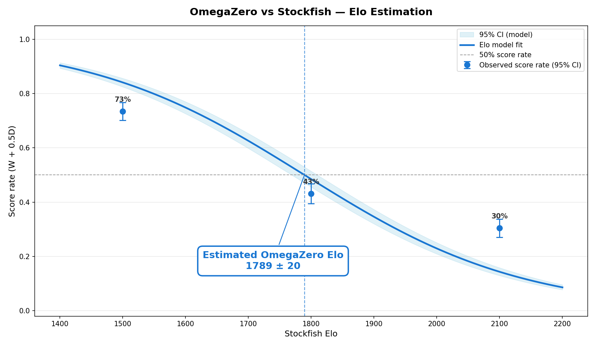
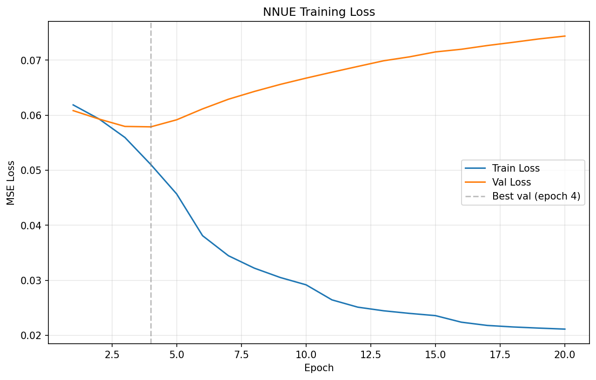
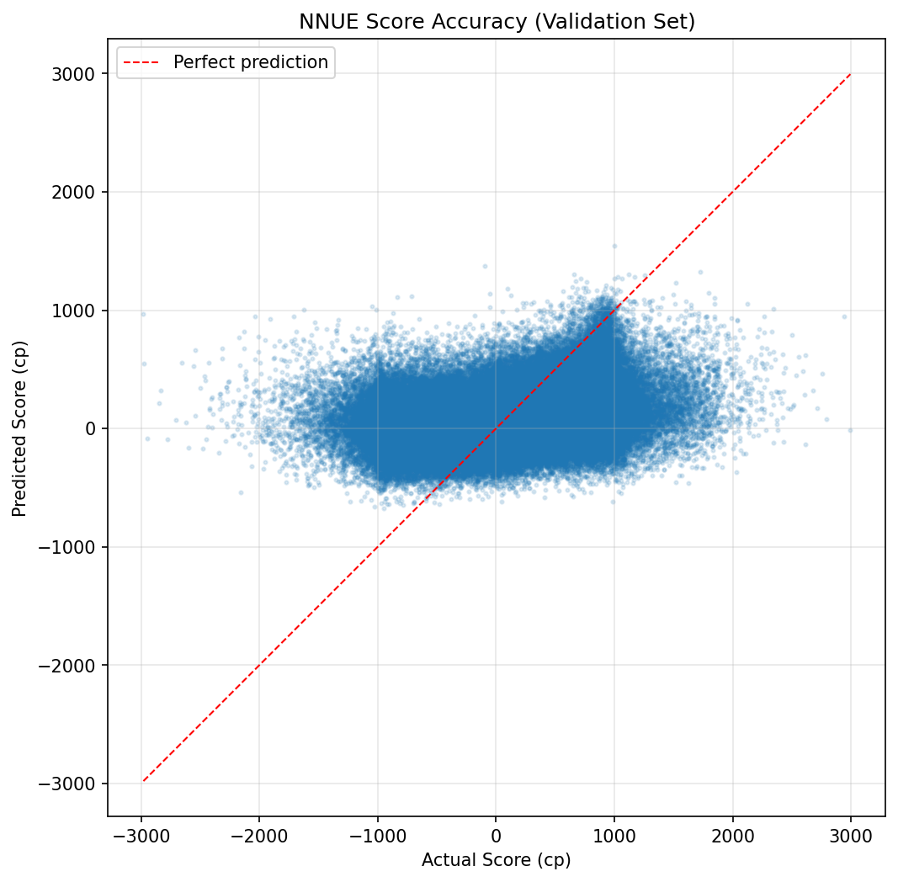

<h1 align="center">OmegaZero</h1>

<p align="center">
  
</p>

<p align="center">
  Proudly open source, ruthlessly tactical, and queer-built 🏳️‍🌈 
</p>

<p align="center">
  <a href="./LICENSE">
    
  </a>
  
  
  
  
</p>

<p align="center">
  <a href="#project-summary">Project Summary</a> •
  <a href="#play-online">Play Online</a> •
  <a href="#performance">Performance</a> •
  <a href="#implementation">Implementation</a> •
  <a href="#usage">Usage</a>
</p>

## Project Summary

OmegaZero is a chess engine built from scratch which allows a user to play 
against an AI. The name "OmegaZero" is an homage to [AlphaZero](https://en.wikipedia.org/wiki/AlphaZero), a program
developed by [DeepMind](https://deepmind.com/) that was used to create one of the world's
best Chess engines. The [Chess Programming Wiki](https://www.chessprogramming.org/Main_Page) was referenced heavily during
development. Credit goes to [Brandon Hsu](https://github.com/2brandonh) for designing the original
logo; [Claude](https://en.wikipedia.org/wiki/Claude_(language_model)) was used to stylize the image after the [No Game No Life](https://en.wikipedia.org/wiki/No_Game_No_Life) anime.

## Performance

All results use [OmegaZero v3](https://github.com/noah8368/OmegaZero/releases/tag/v3).

### Elo Estimate

OmegaZero's rating estimated by fitting the standard Elo logistic curve to 2,100 games against Stockfish at three `UCI_Elo` levels (0.5s/move). Shaded region shows the 95% bootstrap confidence interval.

<p align="center">
  
</p>

### Elo Gain

Elo gain per version, measured via [SPRT](#sprt) (0.5s/move, 2,678 ECO openings). Each bar shows the estimated rating improvement over the previous version.

<p align="center">
  
</p>

### Win / Draw / Loss Breakdown

Win/draw/loss breakdown for each version pair from the same SPRT gauntlet.


### Example Games

<details>
<summary><strong>~1000 Elo Human Player (White) vs OmegaZero v1 (Black) — 0-1</strong> English Opening, Symmetrical Variation.</summary>

`1.c4 c5 2.Nc3 Nc6 3.d4 cxd4 4.Nd5 e6 5.Nf4 Bb4+ 6.Bd2 Bxd2+ 7.Qxd2 Nf6 8.Nf3 Ne4 9.Qd3 Qa5+ 10.Nd2 d5 11.cxd5 exd5 12.g3 Bg4 13.Nxd5 Nxd2 14.Qxd2 Qxd5 15.Rg1 0-0-0 16.h3 Bxe2 17.Bxe2 Rhe8 18.0-0-0 Qxa2 19.Bg4+ Kb8 20.Qf4+ Ne5 21.Rxd4 Rxd4 22.Qxd4 Qa1+ 23.Kc2 Qxg1 24.Qd6+ Ka8 25.Bd1 Qxf2+ 26.Qd2 Rc8+ 27.Kb3 Qxd2 28.Ka2 Qxd1 29.g4 Qa4+ 30.Kb1 Qc2+ 31.Ka2 Nd3 32.h4 Qxb2# 0-1`

Final Position

<p align="center">
  
</p>

</details>

<details>
<summary><strong>1643 Elo<sup>1</sup> Human Player (White) vs OmegaZero v1 (Black) — 0-1</strong> Scandinavian Defense.</summary>

`1.e4 d5 2.exd5 Nf6 3.Bc4 Nxd5 4.Bxd5 Qxd5 5.Nc3 Qxg2 6.Qf3 Qxf3 7.Nxf3 Na6 8.a3 Bg4 9.Ne5 Bf5 10.d3 f6 11.Nc4 e5 12.Be3 Nc5 13.b4 Ne6 14.O-O-O Bg4 15.Rd2 c5 16.b5 O-O-O 17.Ne4 Be7 18.Ng3 Nd4 19.h3 Be6 20.Nb2 Nxb5 21.a4 Nd4 22.Ne4 f5 23.Nc3 Nf3 24.Re2 e4 25.dxe4 fxe4 26.Nxe4 Bxh3 27.Rxh3 Ng1 28.Re1 Nxh3 29.Nxc5 Bxc5 30.Bxc5 b6 31.Be3 Rhf8 32.Nd3 Rxd3 33.cxd3 Nxf2 34.Kd2 Rf7 35.Re2 Ng4 36.Bd4 Kb7 37.Rg2 Rf4 38.Bxg7 Rxa4 39.Kc3 Ne3 40.Re2 Nd5+ 41.Kb3 Rb4+ 42.Ka3 Rb5 43.d4 Ra5+ 44.Kb3 Ra1 45.Kc4 Rg1 46.Be5 Rg2 47.Re4 Kc6 48.Bh8 Rc2+ 49.Kd3 Rc3+ 50.Kd2 Rh3 51.Re6+ Kb5 52.Rd6 Rh2+ 53.Kd3 Rh5 54.Rd7 Nb4+ 55.Kc3 Rh3+ 56.Kd2 Nc6 57.d5 Rh2+ 58.Kc3 Nb4 59.d6 Nc6 60.Rc7 Rh4 61.d7 Rh3+ 62.Kd2 Rh5 63.Rc8 Rd5+ 0-1`

Final Position

<p align="center">
  
</p>

</details>

<details>
<summary><strong>~1900 Elo<sup>2</sup> Human Player vs OmegaZero v1 (Black) — 1-0</strong> Queen's Gambit Accepted.</summary>

`1.d4 d5 2.c4 e6 3.g3 dxc4 4.Bg2 Ne7 5.Nd2 Qxd4 6.Ngf3 Qc5 7.O-O Nd5 8.Qc2 c3 9.Ne4 cxb2 10.Qxb2 Qb6 11.Qc2 Nb4 12.Qa4+ Bd7 13.Qd1 Nxa2 14.Rxa2 Qb1 15.Qc2 Qxa2 16.Qxa2 f5 17.Neg5 Nc6 18.Nxe6 Bd6 19.Nxg7+ Kd8 20.Bg5+ Kc8 21.Rb1 Nb4 22.Qc4 Bxg3 23.Qxb4 Bc6 24.hxg3 Bxf3 25.Bxf3 b6 26.Nxf5 h5 27.Bxa8 h4 28.Qe4 Rd8 29.Ne7+ Kd7 30.Bc6+ Kd6 31.Qd5# 1-0`

Final Position

<p align="center">
  
</p>

</details>

<sup>1</sup> Lichess rating
<sup>2</sup> Chess.com rating

## Play Online

OmegaZero is live on Lichess as a bot! You can challenge it to a game anytime:

**[Challenge OmegaZero-Bot on Lichess](https://lichess.org/@/OmegaZero-Bot)**

The bot runs the same engine described below, connected via the UCI protocol.

## Implementation

### Evaluation

OmegaZero primarily evaluates positions using an [NNUE](https://www.chessprogramming.org/NNUE) (Efficiently Updatable Neural Network).

- Uses the [HalfKP](https://www.chessprogramming.org/Stockfish_NNUE) feature set.
- Encodes 40,960 sparse `(king_square, piece_type, piece_square)` features per perspective.
- Typically only ~30 features are active in a given position.
- Network weights are quantized to `int16` and `int8` for fast integer inference.

Training loss and score accuracy from a 6M-position dataset (v3, HCE-generated):

<p align="center">
  
  
</p>

If no NNUE weights file is available, OmegaZero falls back to a handcrafted evaluation inspired by [Fruit](https://www.chessprogramming.org/Fruit), incorporating:

- Material balance
- [Piece-square tables](https://www.chessprogramming.org/Simplified_Evaluation_Function)
- [Pawn structure](https://www.chessprogramming.org/Pawn_Structure)
- [Piece mobility](https://www.chessprogramming.org/Mobility)
- [King safety](https://www.chessprogramming.org/King_Safety)
- [Tapered evaluation](https://www.chessprogramming.org/Tapered_Eval)

Additional positional bonuses include the [bishop pair](https://www.chessprogramming.org/Bishop_Pair), connected rooks, [castling rights](https://www.chessprogramming.org/Castling_Rights), and [rook behind passer](https://www.chessprogramming.org/Tarrasch_Rule).

See [NNUE](#nnue) for training details.

### Search

The animation below shows a subset of notes from the search trace performed by [OmegaZero v3](https://github.com/noah8368/OmegaZero/releases/tag/v3). The board position is from one of [Deep Blue's](https://www.chessprogramming.org/Deep_Blue) games, with Deep Blue to move (Deep Blue chose the move `Nxe6`).

<p align="center">
  
</p>

OmegaZero uses [MTD(f)](https://www.chessprogramming.org/MTD(f)) within an [Iterative Deepening](https://www.chessprogramming.org/Iterative_Deepening) framework built on [Negamax](https://www.chessprogramming.org/Negamax) and [Alpha-Beta Pruning](https://www.chessprogramming.org/Alpha-Beta).


#### Search Enhancements

- [Null Move Pruning](https://www.chessprogramming.org/Null_Move_Pruning)
- [Futility Pruning](https://www.chessprogramming.org/Futility_Pruning)
- [Reverse Futility Pruning](https://www.chessprogramming.org/Reverse_Futility_Pruning)
- [Late Move Reductions (LMR)](https://www.chessprogramming.org/Late_Move_Reductions)
- [Late Move Pruning (LMP)](https://www.chessprogramming.org/Futility_Pruning#Move_Count_Based_Pruning)

#### Transposition Table

A custom [Transposition Table](https://www.chessprogramming.org/Transposition_Table) is heavily integrated into search, allowing OmegaZero to avoid re-evaluating previously explored positions and efficiently track the principal variation between iterations.

- [Zobrist Hashing](https://www.chessprogramming.org/Zobrist_Hashing) is used to uniquely identify positions.
- Stores node types, search depths, and best moves.
- Uses a [two-tier replacement scheme](https://www.chessprogramming.org/Transposition_Table#Two-tier_System):
  - Always Replace
  - Depth Preferred
- Hash moves retrieved from the table are validated before use to guard against rare hash collisions.

#### Move Ordering

OmegaZero prioritizes moves using:

1. [Hash Move](https://www.chessprogramming.org/Hash_Move)
2. Promotions and favorable captures ordered by [Static Exchange Evaluation (SEE)](https://www.chessprogramming.org/Static_Exchange_Evaluation)
3. [Killer Moves](https://www.chessprogramming.org/Killer_Heuristic)
4. Quiet moves ordered by the [History Heuristic](https://www.chessprogramming.org/History_Heuristic) and [Countermove Heuristic](https://www.chessprogramming.org/Countermove_Heuristic)
5. Unfavorable captures ordered by SEE

Efficient move ordering increases the likelihood of early beta cutoffs, reducing the number of nodes that must be searched.

#### Quiescence Search

To reduce the [Horizon Effect](https://www.chessprogramming.org/Horizon_Effect), OmegaZero extends leaf nodes with a [Quiescence Search](https://www.chessprogramming.org/Quiescence_Search) over tactical moves.

Additional pruning techniques include:

- [Delta Pruning](https://www.chessprogramming.org/Delta_Pruning)
- [SEE Pruning](https://www.chessprogramming.org/Static_Exchange_Evaluation#Pruning)

#### Search Depth vs Time

Search depth reached across four standard positions at increasing time controls (log scale). Endgame positions search deepest due to fewer pieces; kiwipete is the most complex due to its high branching factor. Depth results displayed below are from [OmegaZero v3](https://github.com/noah8368/OmegaZero/releases/tag/v3).

<p align="center">
  
</p>

### Move Generation

- Precomputed attack tables are used for non-sliding pieces.
- Sliding piece attacks are generated using the [Magic Bitboard](http://pradu.us/old/Nov27_2008/Buzz/research/magic/Bitboards.pdf) technique.
- The engine generates [pseudo-legal moves](https://www.chessprogramming.org/Move_Generation#Pseudo-legal), with legality verified during move execution.

### Board Representation

- Hybrid board representation using both [Bitboards](https://www.chessprogramming.org/Bitboards) and an [8×8 Board](https://www.chessprogramming.org/8x8_Board).
- Squares are indexed using [Little Endian Rank File (LERF)](https://www.chessprogramming.org/Square_Mapping_Considerations#Little-Endian_Rank-File_Mapping) mapping.
- Bitboards are used for efficient move generation and attack calculations, while the 8×8 board simplifies position updates and move validation.

### Opening Book

- Uses a PGN opening book containing 2,678 openings spanning the full ECO classification (A00–E99).
- During the opening phase, a line is selected randomly to improve game variety.
- The opening book is derived from [`p3ECO.txt`](https://www.enpassant.dk/chess/palview/manual/p3eco.htm) by Paul Onstad, with contributions from Franz Hemmer and J.E.H. Shaw.
- The same PGN format is used by cutechess-cli during automated testing to increase opening diversity.

### Usage

#### Prerequisites

The `Makefile` supports GNU/Linux and macOS. Install the core dependencies first, then add optional ones as needed.

**Core (required to build and play)**

| | Ubuntu | macOS ([Homebrew](https://brew.sh/)) |
|---|---|---|
| C++ / build tools | `sudo apt-get install g++ make` | Xcode Command Line Tools |
| Python 3 | `sudo apt-get install python3` | pre-installed |

Verify everything is in place:
```
make check-deps
```

**NNUE training** (datagen + training scripts)
```
pip3 install torch tqdm
```

**Elo testing** ([Stockfish](https://stockfishchess.org/) + [cutechess-cli](https://github.com/cutechess/cutechess) + [matplotlib](https://matplotlib.org/))

On Ubuntu:
```
sudo apt-get install stockfish cutechess qtbase5-dev cmake
pip3 install matplotlib
```

On macOS (cutechess must be built from source):
```bash
brew install stockfish qt cmake
pip3 install matplotlib --break-system-packages

cd ~/path/to/OmegaZero
git clone https://github.com/cutechess/cutechess.git
cd cutechess && mkdir build && cd build
cmake .. && make -j8
```

#### Building

```
make              # Optimized engine binary → build/OmegaZero
make debug        # Debug harness (ASan, -O0) → build/debug_harness
make bench        # NPS benchmark harness (-O3) → build/bench_harness
make clean        # Remove all build artifacts
make datagen      # NNUE training data generation harness → build/datagen_harness
make check-deps   # Verify g++ and python3 are installed
```

#### Playing a Game

To begin a game, a user invokes the program as follows:
```
OmegaZero -p [SIDE] -t [TIME]
```
where `[SIDE]` is the side the user would like to play. This may be `w` for
White, `b` for Black, or `r` for a random selection. `[TIME]` is the amount of time (in seconds) to give the engine during play. This defaults to `5s`.

To use the handcrafted eval instead of NNUE, add `--hce`:
```
OmegaZero --hce -p w -t 5
```

The board display defaults to dark terminal backgrounds (filled glyphs = white pieces). If using a light terminal, add `--light-theme`:
```
OmegaZero --light-theme -p w
```

<p align="center">
  
  <br>
  <em>Terminal Interface on Light and Dartk Backgrounds</em>
</p>

To start from a custom position, add `-i` with a [FEN](https://www.chessprogramming.org/Forsyth-Edwards_Notation) string. Use `w` or `b` in the FEN to set which side moves first:
```
OmegaZero -i "rnbqkbnr/pppppppp/8/8/4P3/8/PPPP1PPP/RNBQKBNR w KQkq - 0 1" -p w -t 5  # white to move
OmegaZero -i "rnbqkbnr/pppppppp/8/8/4P3/8/PPPP1PPP/RNBQKBNR b KQkq - 0 1" -p b -t 5  # black to move
```

The format used to denote entered moves is based around [FIDE standard algebraic
notation](https://www.chessprogramming.org/Algebraic_Chess_Notation#Standard_Algebraic_Notation_.28SAN.29). The only exception to FIDE notation is that `e.p.` **must** immediately
follow an en passant move without a space (in FIDE rules, this is optional). Further specification is only needed
to avoid ambiguity in a movement command. Some valid example moves are
 - Move pawn to e4: `e4`
 - Move queen to e4: `Qe4`
 - Move pawn to d8 and promote to queen: `d8Q`
 - Pawn takes piece on d6: `exd6`
 - Knight takes piece on e4: `Nxe4`
 - Rook on rank 1 moves to a3: `R1a3`
 - Rook on d file moves to f8: `Rdf8`
 - Pawn takes a piece on d8 and promotes to queen: `exd8Q`
 - Queen from h4 moves to e1: `Qh4e1`
 - Queen from h4 takes piece on e1: `Qh4xe1`
 - Pawn from e file takes pawn on d5 in en passant: `exd6e.p.`
 - Queenside castle: `0-0-0`
 - Kingside castle: `0-0`

To resign, a user must enter `q` on their turn.

#### UCI Mode

OmegaZero supports the [Universal Chess Interface](https://www.chessprogramming.org/UCI) (UCI) protocol for integration with chess GUIs and tournament managers:
```
OmegaZero --uci
```
The engine is single-threaded; `stop` is a no-op (search completes before input is read) and `go infinite` is not supported.

### Testing

#### SPRT

[SPRT](https://www.chessprogramming.org/Match_Statistics#SPRT) determines whether a new version is stronger than a baseline, stopping automatically once statistically significant. Uses `openings.pgn` (2,678 ECO openings) by default. See `python3 scripts/sprt.py --help` for all options.
```bash
python3 scripts/sprt.py match v1 v3              # compare any two git refs
python3 scripts/sprt.py gauntlet                  # SPRT across all version tags
python3 scripts/sprt.py run --baseline-commit HEAD~1
python3 scripts/sprt.py plot                      # regenerate Elo/W-D-L charts
```

#### Elo Estimation

Fits the standard Elo logistic curve to match results against multiple Stockfish levels, producing a statistically grounded rating estimate with bootstrap confidence intervals. See `python3 scripts/elo.py --help` for all options.
```bash
python3 scripts/elo.py run               # 500 games × 7 levels (1700–2300), 1s/move
python3 scripts/elo.py run --games 50 --st 0.5  # quick smoke test
python3 scripts/elo.py plot results/elo/<run>/summary.csv
```

#### Search Benchmarking

Measures NPS (nodes per second) across four standard positions. See `python3 scripts/search_bench.py --help` for all options.
```bash
python3 scripts/search_bench.py run               # benchmark current build (5s/position)
python3 scripts/search_bench.py gauntlet           # benchmark all tagged versions
python3 scripts/search_bench.py plot               # regenerate NPS plot
```

#### Perft

Verifies move generator correctness using [Perft](https://www.chessprogramming.org/Perft) node counting against [six standard positions](https://www.chessprogramming.org/Perft_Results). See `python3 scripts/perft.py --help` for all options.
```bash
python3 scripts/perft.py run                      # all 6 positions, depth 1-5
python3 scripts/perft.py run --max-depth 6         # deeper (slower)
python3 scripts/perft.py list                      # show all positions and expected values
```

#### Debug Harness

Runs perft regression, eval sanity, search sanity, and self-play crash detection:
```
make debug
./build/debug_harness
```

### NNUE

Generate self-play data, train, analyze. Config lives in `nnue/config.json` (copy from `nnue/config.json.example`). See each script's `--help` or header comments for options.
```bash
make datagen && ./scripts/run_datagen.sh     # generate data (auto-restarts on crash)
./scripts/shutdown_datagen.sh                # graceful shutdown
./scripts/sync_from_server.sh                # pull data from remote server
./scripts/combine_runs.sh                    # merge runs with dedup
python3 scripts/train_nnue.py                # train (see --help for all params)
cp nnue/model/<run>/best.bin nnue/nnue.bin && make
python3 scripts/plot_training.py data        # analyze data distributions
python3 scripts/plot_training.py model       # evaluate model accuracy
```

### Generating Move Tables

The engine relies on two precomputed source files for move generation.
These are checked into the repo and only need to be regenerated if the
underlying scripts change:

- `scripts/generate_masks.py` — generates `src/masks.cc`, which contains
  precomputed attack bitboards for non-sliding pieces (knights, kings, pawns)
  at every square.
- `scripts/mine_magics.py` — generates `src/magics.cc`, which contains
  [magic numbers](https://www.chessprogramming.org/Magic_Bitboards) for
  sliding piece (bishop, rook) move generation.

To regenerate:
```
python3 scripts/generate_masks.py
python3 scripts/mine_magics.py
```

`make` will automatically regenerate these files if they are missing.
