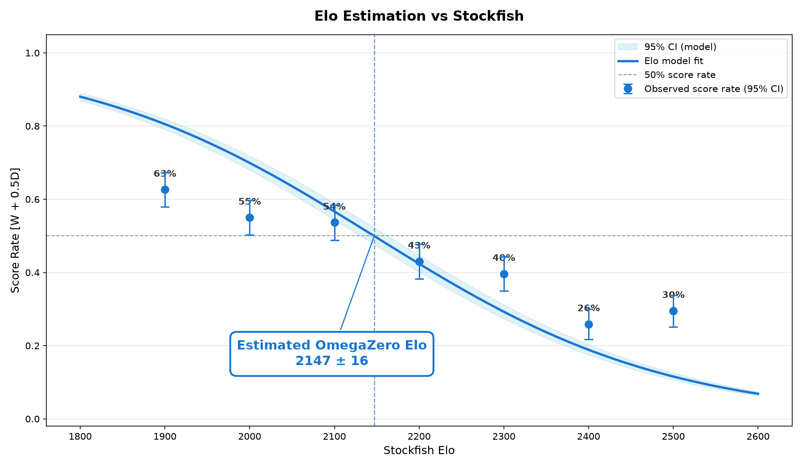
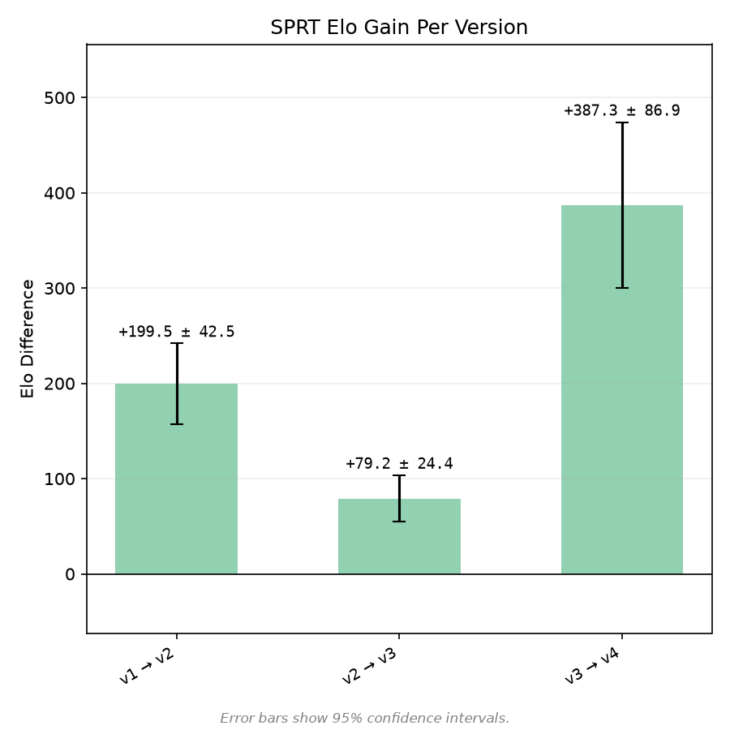
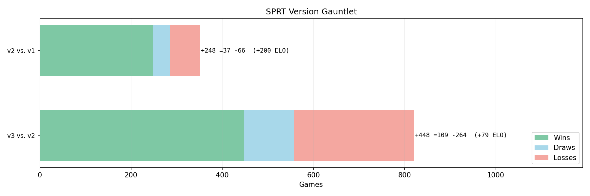
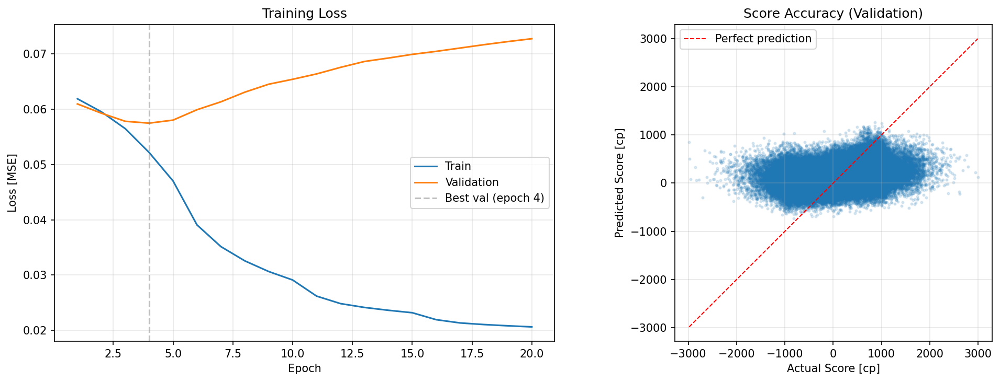
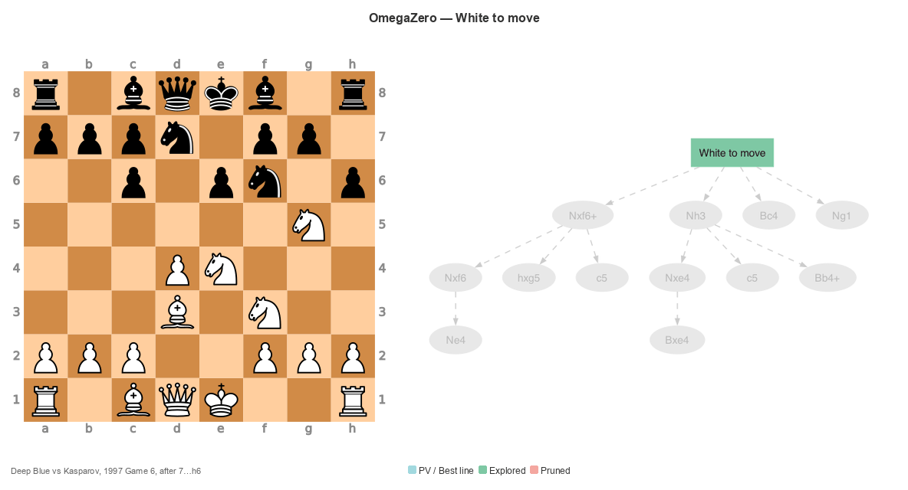
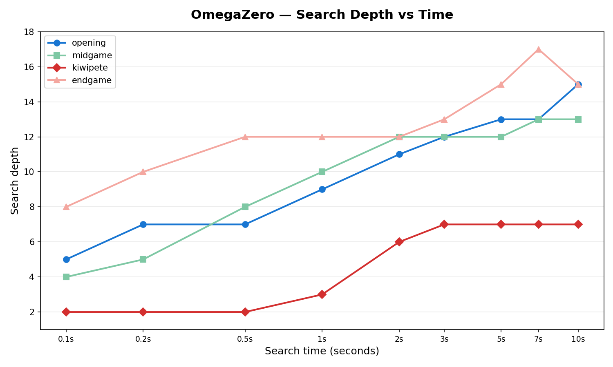
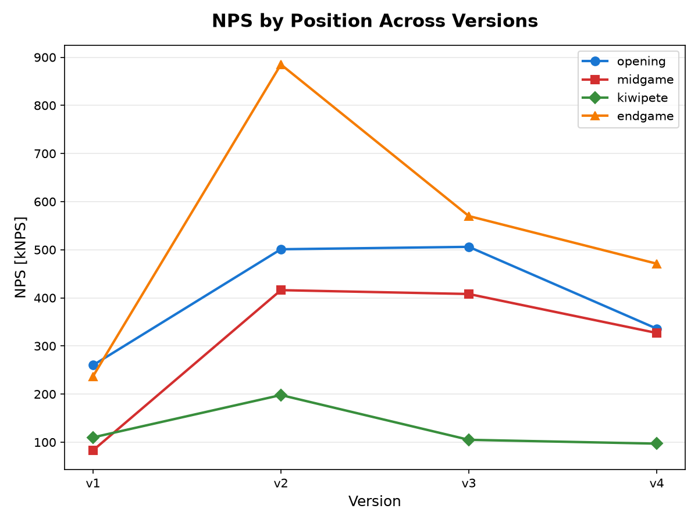
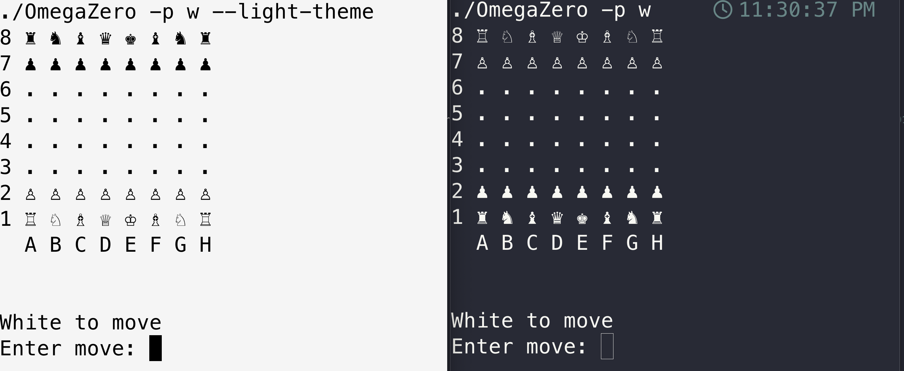
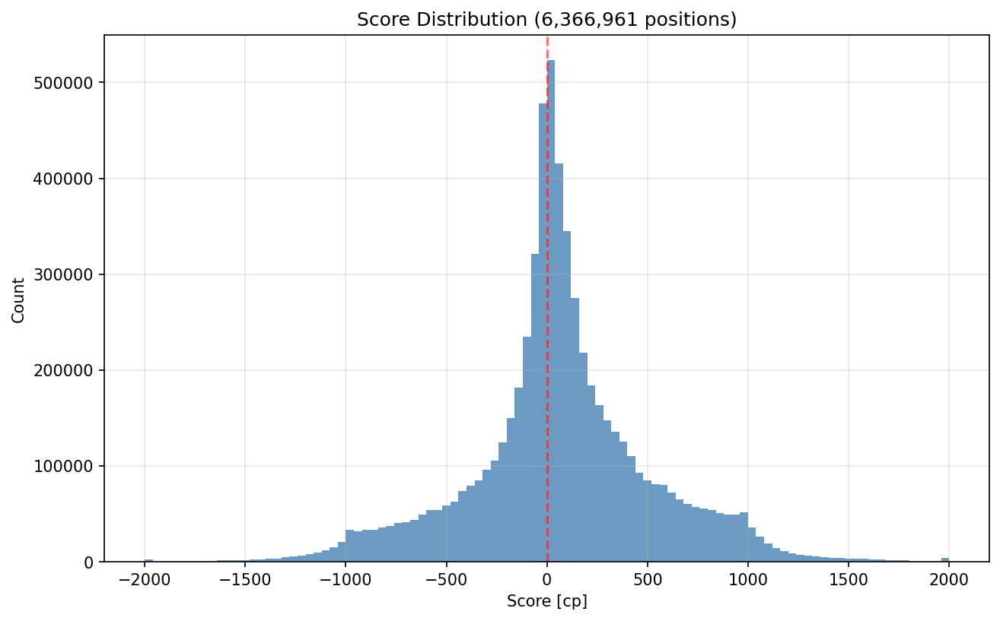

<h1 align="center">OmegaZero</h1>

<p align="center">
  
</p>

<p align="center">
  Proudly open source, ruthlessly tactical, and queer-built 🏳️‍🌈 
</p>

<p align="center">
  <a href="./LICENSE">
    
  </a>
  
  
  
  
</p>

<p align="center">
  <a href="#project-summary">Project Summary</a> •
  <a href="#performance">Performance</a> •
  <a href="#play-online">Play Online</a> •
  <a href="#implementation">Implementation</a> •
  <a href="#usage">Usage</a>
</p>

## Project Summary

OmegaZero is a chess engine with a built-in terminal interface. The name *OmegaZero* is a nod to [AlphaZero](https://en.wikipedia.org/wiki/AlphaZero). The engine began as a passion project after its author learned to play chess during the COVID-19 pandemic and became fascinated by the algorithms behind chess engines.

## Performance

### Elo Estimate

<p align="center">
  
  <br>
  <em>Elo estimate from 2,800 games of OmegaZero v4 vs Stockfish (1s/move), with 95% bootstrap CI.</em>
</p>

### Elo Gain

<p align="center">
  
  <br>
  <em>Elo gain per version via SPRT (0.5s/move, 2,678 ECO openings).</em>
</p>

### Win / Draw / Loss Breakdown

<p align="center">
  
  <br>
  <em>Win/draw/loss breakdown per version pair from the SPRT gauntlet.</em>
</p>

### Example Games

<details>
<summary><strong>1000-Rated Player (White) vs OmegaZero v5 (Black) — 0-1</strong> King's Fianchetto Opening: Reversed Alekhine.</summary>

`1.g3 d5 2.Bg2 e5 3.Nf3 e4 4.Nd4 c5 5.Nb3 c4 6.Nd4 Bc5 7.e3 Bxd4 8.exd4 Nf6 9.Nc3 Nc6 10.0-0 Nxd4 11.d3 Bg4 12.f3 Nxf3+ 13.Bxf3 Qb6+ 14.d4 Bxf3 15.Rxf3 exf3 16.Qxf3 0-0 17.Nxd5 Qxd4+ 18.Ne3 Rad8 19.c3 Qc5 20.b4 cxb3e.p. 21.axb3 Qxc3 22.Rb1 Rfe8 23.Kg2 Ne4 24.Nf5 Qc2+ 25.Kh3 Qxb1 26.Bh6 gxh6 27.Qg4+ Ng5+ 28.Kh4 Re4 29.Nxh6+ Kg7 30.Nf5+ Kg6 31.Ne7+ Kf6 32.Qf4+ Rxf4+ 33.gxf4 Qe1+ 34.Kh5 Qe2+ 35.Kh4 Qxh2+ 36.Kg4 Qh3# 0-1`

Final Position:

<p align="center">
  
</p>

OmegaZero Wins.

</details>


## Play Online

OmegaZero is live on Lichess as a bot! You can challenge it to a game anytime:

**[Challenge OmegaZero-Bot on Lichess](https://lichess.org/@/OmegaZero-Bot)**

The bot runs the same engine described below, connected via the UCI protocol.

## Implementation

### Evaluation

OmegaZero primarily evaluates positions using an [NNUE](https://www.chessprogramming.org/NNUE) (Efficiently Updatable Neural Network), specifically the [HalfKP](https://www.chessprogramming.org/Stockfish_NNUE) architecture. Network weights are quantized to `int16` and `int8` for fast integer inference.

<p align="center">
  
  <br>
  <em>Training loss and score accuracy on a 100M-position self-play dataset (95.5M train / 5M validation) generated by OmegaZero</em>
</p>

If the expected NNUE weights file isn't found (`nnue/nnue.bin`), OmegaZero falls back to a handcrafted evaluation inspired by [Fruit](https://www.chessprogramming.org/Fruit), incorporating:

- [Material balance](https://www.chessprogramming.org/Material)
- [Piece-square tables](https://www.chessprogramming.org/Simplified_Evaluation_Function)
- [Pawn structure](https://www.chessprogramming.org/Pawn_Structure)
- [Piece mobility](https://www.chessprogramming.org/Mobility)
- [King safety](https://www.chessprogramming.org/King_Safety)
- [Tapered evaluation](https://www.chessprogramming.org/Tapered_Eval)

Additional positional bonuses include the [bishop pair](https://www.chessprogramming.org/Bishop_Pair), connected rooks, [castling rights](https://www.chessprogramming.org/Castling_Rights), and [rook behind passer](https://www.chessprogramming.org/Tarrasch_Rule).

See [NNUE](#nnue) for training instructions.

### Search

<p align="center">
  
  <br>
  <em>
    Search trace performed by OmegaZero v4 on a board position from
    <a href="https://www.chessprogramming.org/Kasparov_versus_Deep_Blue_1997#Game_6">
      Deep Blue v Kasparov
    </a>
  </em>
</p>

OmegaZero uses [Principle Variation Search (PVS) and Aspiration Windows](https://www.chessprogramming.org/Principal_Variation_Search#PVS_and_Aspiration) alongside the following pruning alogrithms to maximize search depth:

- [Null Move Pruning (NMP)](https://www.chessprogramming.org/Null_Move_Pruning)
- [Futility Pruning (FP)](https://www.chessprogramming.org/Futility_Pruning)
- [Reverse Futility Pruning (RFP)](https://www.chessprogramming.org/Reverse_Futility_Pruning)
- [Late Move Reductions (LMR)](https://www.chessprogramming.org/Late_Move_Reductions)
- [Late Move Pruning (LMP)](https://www.chessprogramming.org/Futility_Pruning#Move_Count_Based_Pruning)
- [Internal Iterative Reductions (IIR)](https://www.chessprogramming.org/Internal_Iterative_Reductions)
- [Razoring](https://www.chessprogramming.org/Razoring)
- [Singular Extensions](https://www.chessprogramming.org/Singular_Extensions)

NMP, RFP, LMR, and LMP prune more aggresively if the static evaluations of a
search line aren't [improving](https://www.chessprogramming.org/Improving). The
static evaluations driving these decisions are further refined by a
[Correction History](https://www.chessprogramming.org/Static_Evaluation_Correction_History).

#### Transposition Table

A custom [Transposition Table](https://www.chessprogramming.org/Transposition_Table) is heavily integrated into search, allowing OmegaZero to avoid re-evaluating previously explored positions and efficiently track the principal variation between iterations. [Zobrist Hashing](https://www.chessprogramming.org/Zobrist_Hashing) is used to hash positions efficiently. The table uses a [two-tier replacement scheme](https://www.chessprogramming.org/Transposition_Table#Two-tier_System). Table entries store node types, search depths, and best moves.

#### Parallel Search

On multi-core machines, OmegaZero searches in parallel using [Lazy SMP](https://www.chessprogramming.org/Lazy_SMP): multiple threads search the same position independently and share knowledge through the transposition table, which is [lock-free](https://www.chessprogramming.org/Shared_Hash_Table#Lock-less) so threads can probe and update it concurrently without locking. The thread count defaults to the number of available cores and is configurable via the UCI `Threads` option or the `--threads` flag.

#### Endgame Tablebases

When [Syzygy](https://www.chessprogramming.org/Syzygy_Bases) tablebases are present, the search probes them for a perfect Win/Draw/Loss verdict at low-piece positions (via the vendored [Fathom](https://github.com/jdart1/Fathom) prober), returning an exact score and cutting off the subtree. Probing is thread-safe, so it works within the parallel search. See [Endgame Tablebases (Syzygy)](#endgame-tablebases-syzygy) for setup.

#### Move Ordering

During Aspiration + PV Search, OmegaZero prioritizes moves using:

1. [Hash Move](https://www.chessprogramming.org/Hash_Move)
2. Promotions and favorable captures ordered by [Static Exchange Evaluation (SEE)](https://www.chessprogramming.org/Static_Exchange_Evaluation) and [Capture History](https://www.chessprogramming.org/History_Heuristic#Capture_History)
3. [Killer Moves](https://www.chessprogramming.org/Killer_Heuristic)
4. Quiet moves ordered by [History Heuristic](https://www.chessprogramming.org/History_Heuristic), [Countermove Heuristic](https://www.chessprogramming.org/Countermove_Heuristic), and [Continuation History](https://www.chessprogramming.org/History_Heuristic#Continuation_History).
5. Unfavorable captures ordered by SEE and Capture History

In [Quiescence Search](#quiescence-search), moves are ordered by putting captures first. Captures are sorted according to the [MVV-LVA Heuristic](https://www.chessprogramming.org/MVV-LVA). Efficient move ordering increases the likelihood of early beta cutoffs, reducing the number of nodes that must be searched.

#### Quiescence Search

To reduce the [Horizon Effect](https://www.chessprogramming.org/Horizon_Effect), OmegaZero extends leaf nodes with a [Quiescence Search](https://www.chessprogramming.org/Quiescence_Search) over tactical moves. [Delta Pruning](https://www.chessprogramming.org/Delta_Pruning) and [SEE Pruning](https://www.chessprogramming.org/Static_Exchange_Evaluation#Pruning) are used to keep the search space from exploding.

<p align="center">
  
  <br>
  <em>Search depth vs time across four standard positions (log scale) from OmegaZero v4</em>
</p>

#### Time Management

Under a clock, OmegaZero must decide how long to think without flagging on time. From the remaining time and increment it derives a **soft** target, checked between [iterative deepening](https://www.chessprogramming.org/Iterative_Deepening) iterations, and a **hard** cap that aborts a search in progress — sized so a reserve always remains to avoid flagging. A difficulty-scaled refinement of the soft target — rescaling a neutral base budget by a factor of the form `1 + Σ wᵢ·sᵢ` over signed stability signals (best-move stability, score stability, and node-effort distribution) so the engine banks time on quiet positions and thinks longer on unstable ones — is implemented but gated off pending tuning. See [Time Management](https://www.chessprogramming.org/Time_Management).

### Move Generation

Precomputed attack tables are used for non-sliding pieces, and sliding piece attacks are generated using the [Magic Bitboard](http://pradu.us/old/Nov27_2008/Buzz/research/magic/Bitboards.pdf) technique. The engine generates [pseudo-legal moves](https://www.chessprogramming.org/Move_Generation#Pseudo-legal), with legality verified during move execution. The correctness of the move generator was confirmed using [Perft](https://www.chessprogramming.org/Perft) with
the positions from [this page](https://www.chessprogramming.org/Perft_Results).

<p align="center">
  
  <br>
  <em>NPS by Position Across Versions (5s/position, MacBook M4)</em>
</p>

### Board Representation

OmegaZero uses a hybrid board representation using both [Bitboards](https://www.chessprogramming.org/Bitboards) and an [8×8 Board](https://www.chessprogramming.org/8x8_Board). Bitboards are used for efficient move generation and attack calculations, while the 8×8 board simplifies position updates and move validation. Squares are indexed using [Little Endian Rank File (LERF)](https://www.chessprogramming.org/Square_Mapping_Considerations#Little-Endian_Rank-File_Mapping) mapping. 

### Opening Book

OmegaZero uses a PGN opening book containing 2,678 openings spanning the full ECO classification (A00–E99). The opening book is derived from [`p3ECO.txt`](https://www.enpassant.dk/chess/palview/manual/p3eco.htm) by Paul Onstad, with contributions from Franz Hemmer and J.E.H. Shaw. During the opening phase, a line is selected randomly to improve game variety.

## Usage

### Prerequisites

The `Makefile` supports GNU/Linux and macOS. The easiest way to install everything is with the setup script:

```bash
./scripts/setup.sh             # full install (build tools, venv, Python, Stockfish, cutechess, Syzygy tablebases)
./scripts/setup.sh --no-syzygy # full install, skip the ~1 GB Syzygy tablebase download
./scripts/setup.sh --datagen   # minimal install for datagen server (g++, make, python3 only)
source .venv/bin/activate      # activate the Python environment
```

#### Endgame Tablebases (Syzygy)

The full install downloads the 3-4-5 man [Syzygy](https://www.chessprogramming.org/Syzygy_Bases) tablebases (`.rtbw`/`.rtbz`, ~1 GB) into a `syzygy_tables/` directory at the repo root, where the engine loads them automatically (skip with `--no-syzygy`). They're `.gitignore`d, not committed. The engine auto-detects the largest table size present, so to use 6- or 7-man tables later, drop those files into `syzygy_tables/` (or point `--syzygy DIR` / the `SyzygyPath` UCI option elsewhere) — no rebuild needed. Tablebases are optional; the engine runs normally without them.

Both modes are idempotent — safe to re-run. The script detects your platform (macOS via Homebrew, Linux via apt/dnf/yum), creates a `.venv/` Python environment, and skips anything already installed.

<details>
<summary><strong>Manual installation</strong></summary>

**Core (required to build and play)**

| | Ubuntu | macOS ([Homebrew](https://brew.sh/)) |
|---|---|---|
| C++ / build tools | `sudo apt-get install g++ make` | Xcode Command Line Tools |
| Python 3 | `sudo apt-get install python3` | pre-installed |

Verify everything is in place:
```
make check-deps
```

**NNUE training**

```
pip3 install torch numpy matplotlib tqdm Pillow cairosvg graphviz python-chess
```

**Elo testing**

On Ubuntu:
```
sudo apt-get install stockfish cutechess qtbase5-dev cmake
pip3 install matplotlib
```

On macOS:
```bash
brew install stockfish cutechess graphviz cairo
```

</details>

### Building

```
make              # Optimized engine binary → build/OmegaZero
make debug        # Self-play harness (ASan, -O0) → build/debug_harness
make bench        # NPS benchmark harness (-O3) → build/bench_harness
make perft        # Perft harness (-O3) → build/perft_harness
make datagen      # NNUE training data generation harness → build/datagen_harness
make clean        # Remove all build artifacts
make check-deps   # Verify g++ and python3 are installed
```

### Playing a Game

To begin a game, a user invokes the program as follows:
```
OmegaZero -p [SIDE] --st [TIME]
```
where `[SIDE]` is the side the user would like to play. This may be `w` for
White, `b` for Black, or `r` for a random selection. `[TIME]` is the amount of time (in seconds) to give the engine per move. This defaults to `5s`.

#### Clock Mode

For timed games with a running clock and optional increment:
```
OmegaZero --tc 300 --inc 3 -p w    # 5 minutes + 3 second increment
OmegaZero --tc 60 -p b             # 1 minute, no increment (bullet)
OmegaZero --tc 900 --inc 10 -p w   # 15+10 (rapid)
```
In clock mode, the user's time is tracked while they think. The engine allocates its own think time from its remaining clock. Both sides receive the increment after each move. The game ends on flag (time reaching zero).

#### Other Options

To use the handcrafted eval instead of NNUE, add `--hce`:
```
OmegaZero --hce -p b --st 1
```

Search runs across all available CPU cores by default ([Lazy SMP](https://www.chessprogramming.org/Lazy_SMP)). Set the thread count with `--threads`:
```
OmegaZero --threads 4 -p w --st 1
```

To save the completed game as a PGN under `games/`, add `--pgn` with the opponent's name:
```
OmegaZero --pgn Noah -p w --st 1
```
The saved PGN includes a note recording which of OmegaZero's resources were in play — whether the NNUE or handcrafted eval was used, and whether the Syzygy tablebases were loaded and actually reached during the game.

The board display defaults to dark terminal backgrounds (filled glyphs = white pieces). If using a light terminal, add `--light-theme`:
```
OmegaZero --light-theme
```

<p align="center">
  
  <br>
  <em>Terminal Interface on Light and Dark Backgrounds</em>
</p>

To start from a custom position, add `-i` with a [FEN](https://www.chessprogramming.org/Forsyth-Edwards_Notation) string. Use `w` or `b` in the FEN to set which side moves first:
```
OmegaZero -i "rnbqkbnr/pppppppp/8/8/4P3/8/PPPP1PPP/RNBQKBNR w KQkq - 0 1" -p w  # white to move
OmegaZero -i "rnbqkbnr/pppppppp/8/8/4P3/8/PPPP1PPP/RNBQKBNR b KQkq - 0 1" -p b # black to move
```

The format used to denote entered moves is based around [FIDE standard algebraic
notation](https://www.chessprogramming.org/Algebraic_Chess_Notation#Standard_Algebraic_Notation_.28SAN.29). The only exception to FIDE notation is that `e.p.` **must** immediately
follow an en passant move without a space (in FIDE rules, this is optional). Further specification is only needed
to avoid ambiguity in a movement command. Some valid example moves are
 - Move pawn to e4: `e4`
 - Move queen to e4: `Qe4`
 - Move pawn to d8 and promote to queen: `d8Q`
 - Pawn takes piece on d6: `exd6`
 - Knight takes piece on e4: `Nxe4`
 - Rook on rank 1 moves to a3: `R1a3`
 - Rook on d file moves to f8: `Rdf8`
 - Pawn takes a piece on d8 and promotes to queen: `exd8Q`
 - Queen from h4 moves to e1: `Qh4e1`
 - Queen from h4 takes piece on e1: `Qh4xe1`
 - Pawn from e file takes pawn on d5 in en passant: `exd6e.p.`
 - Queenside castle: `0-0-0`
 - Kingside castle: `0-0`

On their turn, a user may also enter `u` to undo their previous move (this takes back both the engine's reply and the user's own last move, returning to the user's prior turn), or `r` to resign.

### UCI Mode

OmegaZero fully supports the [Universal Chess Interface](https://www.chessprogramming.org/UCI) (UCI) protocol, allowing it to be used with compatible chess GUIs and tournament managers.

```
$ OmegaZero --uci
```

OmegaZero supports standard UCI commands including `uci`, `isready`, `ucinewgame`, `position`, `go`, `stop`, `ponderhit`, and `setoption`. Positions may be supplied from the starting position or via FEN, followed by an optional sequence of moves.

Search runs on a worker thread while the main loop continues processing UCI commands. The full set of `go` limits is supported, including `wtime`/`btime`/`winc`/`binc`/`movestogo`, `movetime`, `depth`, `nodes`, `infinite`, and `ponder`. A running search can be stopped at any time with `stop`, which returns the best move found so far, while `ponderhit` converts a ponder search to its normal time budget.

During search, OmegaZero emits standard UCI `info` output for completed iterations before returning `bestmove`.

Multi-threaded search uses [Lazy SMP](https://www.chessprogramming.org/Lazy_SMP). The number of search threads is configurable at runtime through the `Threads` option and defaults to the machine's available core count. Additional search parameters are exposed as UCI options and can be modified using `setoption`.

### Testing

Use the `--help` flag for all options of the Python scripts discussed here.

#### SPRT

[SPRT](https://www.chessprogramming.org/Match_Statistics#SPRT) determines whether a new version is stronger than a baseline, stopping automatically once statistically significant. Uses `openings.pgn` (2,678 ECO openings) by default. 
```bash
python3 scripts/sprt.py match v1 v3              # compare any two git refs
python3 scripts/sprt.py gauntlet                  # SPRT across all version tags
python3 scripts/sprt.py run --baseline-commit HEAD~1
python3 scripts/sprt.py plot                      # regenerate Elo/W-D-L charts
```

#### Elo Estimation

Fits the standard Elo logistic curve to match results against multiple Stockfish levels, producing a statistically grounded rating estimate with bootstrap confidence intervals.
```bash
python3 scripts/elo.py run               # 500 games × 7 levels (1700–2300), 1s/move
python3 scripts/elo.py run --games 50 --st 0.5  # quick smoke test
python3 scripts/elo.py plot results/elo/<run>/summary.csv
```

#### Search Benchmarking

Measures NPS (nodes per second) across four standard positions. 
```bash
python3 scripts/benchmark.py run               # benchmark current build (5s/position)
python3 scripts/benchmark.py gauntlet           # benchmark all tagged versions
python3 scripts/benchmark.py plot               # regenerate NPS plot
```

#### Perft

Verifies move generator correctness using [Perft](https://www.chessprogramming.org/Perft) node counting against [six standard positions](https://www.chessprogramming.org/Perft_Results). 
```bash
python3 scripts/perft.py run                      # all 6 positions, depth 1-5
python3 scripts/perft.py run --max-depth 6         # deeper (slower)
python3 scripts/perft.py list                      # show all positions and expected values
```

#### Self-Play Crash Detection

Plays the engine against itself to detect crashes, illegal moves, and search errors. Built with AddressSanitizer for memory error detection.
```bash
python3 scripts/debug.py                          # 10 games, 0.1s/move
python3 scripts/debug.py --games 100              # longer soak test
python3 scripts/debug.py --games 1000 --search-time 0.05  # fast stress test
```

### NNUE

A pre-built [100M-position training dataset](https://drive.google.com/drive/folders/17ceBeRrqkpMPDzXKoXNYXI3WTelhrDIt?usp=sharing) is available for download. Place the files in `nnue/data/` and run `train_nnue.py` to train from scratch.

<p align="center">
  
  <br>
  <em>NNUE Training Dataset — Score Distribution (95.5M training positions from a 100M-position set)</em>
</p>

To generate your own data, train, and analyze, config lives in `nnue/config.json` (copy from one of the examples below). `run_datagen.sh` reads `mode` and `output` from it, so you switch pipelines by swapping the config. See each script's `--help` or header comments for options.

**Eval data (standard NNUE).** Labels are search scores (3-field: `FEN | score | result`); data lives in `nnue/data`. Config: copy `nnue/config.json.example` → `nnue/config.json` (default `mode`, `output: nnue/data`).
```bash
make datagen && ./scripts/run_datagen.sh     # generate data (auto-restarts on crash)
./scripts/shutdown_datagen.sh                # graceful shutdown
./scripts/sync_from_server.sh                # pull data from remote server
./scripts/combine_runs.sh                    # merge runs with dedup → nnue/data/combined
python3 scripts/train_nnue.py                # train (auto-encodes .txt → .bin; see --help)
cp nnue/model/<run>/best.bin nnue/nnue.bin && make
python3 scripts/plot_training.py data        # analyze data distributions
python3 scripts/plot_training.py model       # evaluate model accuracy
```

**Uncertainty data (NF-002 research).** Labels are eval-error records (7-field: `FEN | v | v_star | u | depth | nodes | result`) for modeling the conditional error distribution `p(u | x)`. This data lives in a **separate** dir, `nnue/data_uncertainty` — `combine_runs.sh` refuses to mix the two schemas in one combined file. Config: copy `nnue/config.uncertainty.json.example` → `nnue/config.json` (`mode: uncertainty`), and set `"output": "nnue/data_uncertainty"`.
```bash
make datagen && ./scripts/run_datagen.sh                          # generate labeled data (mode: uncertainty)
./scripts/combine_runs.sh nnue/data_uncertainty                  # merge runs with dedup → combined/*.txt
.venv/bin/python research/experiments/train_unc_head.py \
    --trunk nnue/nnue.bin \
    --train nnue/data_uncertainty/combined/training_data.txt \
    --val   nnue/data_uncertainty/combined/validation_data.txt   # auto-encodes .txt→.bin; fits p(u|x); writes plots
python3 scripts/plot_unc.py data nnue/data_uncertainty/combined/validation_data.bin   # dataset diagnostics
python3 scripts/plot_unc.py head results/unc_head/<run>/          # re-render a run's calibration plots
```
Like `train_nnue.py`, `train_unc_head.py` auto-encodes `.txt`→`.bin`, so `combine_runs.sh` output feeds it directly; `./scripts/prepare_uncertainty_data.sh` is an optional one-shot that pre-bakes the `.bin`. Training writes calibration/loss plots to a timestamped `results/unc_head/<run>/`. The result is a valid calibration read only when `--trunk` is the **same net** whose eval produced the datagen labels (the `nnue.bin` present at datagen time).

### Generating Move Tables

The engine relies on two precomputed source files for move generation.
These are checked into the repo and only need to be regenerated if the
underlying scripts change:

- `scripts/generate_masks.py` — generates `src/masks.cc`, which contains
  precomputed attack bitboards for non-sliding pieces (knights, kings, pawns)
  at every square.
- `scripts/mine_magics.py` — generates `src/magics.cc`, which contains
  [magic numbers](https://www.chessprogramming.org/Magic_Bitboards) for
  sliding piece (bishop, rook) move generation.

To regenerate:
```
python3 scripts/generate_masks.py
python3 scripts/mine_magics.py
```

`make` will automatically regenerate these files if they are missing.

## Acknowledgments

OmegaZero is developed and maintained by a single person. As the only human working
on the engine, I use [Claude](https://en.wikipedia.org/wiki/Claude_(language_model))
as a debugging and code review aid to supplement my own effort. **Every design decision, all core algorithm implementations, and the direction of the project, remain my own.**

The [Chess Programming Wiki](https://www.chessprogramming.org/Main_Page) was referenced heavily during
development. 

Credit goes to [Brandon Hsu](https://github.com/2brandonh) for designing the original
logo; AI was used to stylize the image after the [No Game No Life](https://en.wikipedia.org/wiki/No_Game_No_Life) anime.
